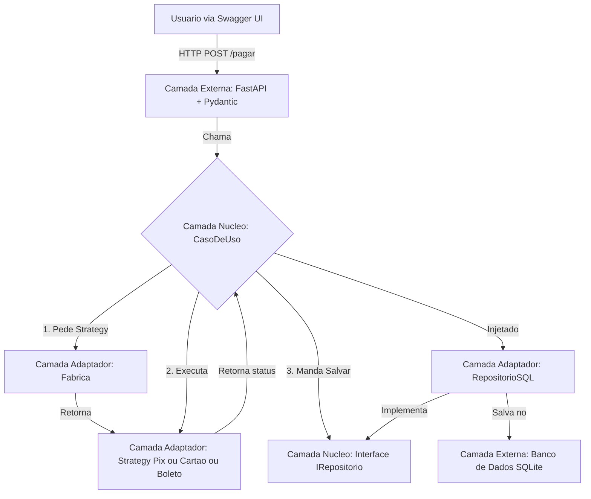

# Gateway de Pagamento (FastAPI + Clean Architecture)

Um projeto de API de gateway de pagamento simples, construído com **Python**, **FastAPI** e **SQLAlchemy**, seguindo os princípios da **Clean Architecture** (Arquitetura Limpa).  
Este projeto demonstra o desacoplamento de camadas, injeção de dependência e o uso de **Design Patterns** (*Strategy*, *Factory*, *Repository*) em um ambiente de produção simulado.

---

## 🌟 Principais Conceitos e Funcionalidades

### Clean Architecture
O código é dividido em camadas independentes (**Núcleo/Entidades**, **Casos de Uso**, **Adaptadores/Infra**, **Externo/API**) para alta coesão, baixo acoplamento e máxima testabilidade.

### Design Patterns
- **Strategy Pattern:** Métodos de pagamento (Pix, Cartão e boleto) são implementados como estratégias intercambiáveis.  
- **Factory Pattern:** Uma fábrica é usada para criar a estratégia de pagamento correta com base na entrada do usuário.  
- **Repository Pattern:** Abstrai a camada de dados, permitindo trocar o banco de dados sem alterar a lógica de negócios.

### Injeção de Dependência
As dependências (como o repositório e a fábrica) são injetadas no caso de uso, facilitando testes e mocks.

### Persistência com SQLAlchemy
Utiliza o SQLAlchemy Core e o padrão **Data Mapper** para mapear entidades Python puras para tabelas do banco de dados (SQLite).

### Testes Automatizados
Cobertura de testes completa com **pytest**, incluindo:
- **Testes de Unidade:** Testam a lógica de negócios isoladamente, usando um repositório falso (Mock).  
- **Testes de Integração:** Testam o fluxo completo da API, desde a requisição HTTP até a escrita no banco de dados real.

### Documentação Automática
A API gera documentação interativa automaticamente via **Swagger UI** (`/docs`) e **ReDoc** (`/redoc`).

---

## 🏗️ Arquitetura e Fluxo de Dados

O projeto segue um fluxo de dados unidirecional, garantindo que as dependências sempre apontem para dentro.



---

## 🛠️ Tech Stack

- **Linguagem:** Python 3  
- **Framework API:** FastAPI  
- **Servidor ASGI:** Uvicorn  
- **Validação de Dados:** Pydantic  
- **ORM / Banco de Dados:** SQLAlchemy (Core) com SQLite  
- **Testes:** Pytest  

---

## 📁 Estrutura de Pastas

```bash
gateway-fastapi/
├── src/
│   ├── main.py             # Camada Externa (API, Injeção de Dependência)
│   ├── caso_de_uso.py      # Camada de Caso de Uso (Lógica de Negócios)
│   ├── entidades.py        # Camada de Núcleo (Modelos Puros)
│   ├── interfaces.py       # Camada de Núcleo (Contratos/Abstrações)
│   ├── estrategias.py      # Camada de Adaptador (Implementação das Strategies)
│   ├── fabrica.py          # Camada de Adaptador (Implementação da Factory)
│   └── repositorio_sql.py  # Camada de Adaptador (Implementação do Repositório)
│
├── tests/
│   ├── repositorio_falso.py # Mock para testes de unidade
│   ├── test_unidade.py      # Testa o Caso de Uso isoladamente
│   └── test_integracao.py   # Testa a API + Banco de Dados
│
├── .gitignore
├── requirements.txt
└── pagamentos.db
```

---

## 🚀 Como Executar o Projeto

### 1. Pré-requisitos
- Python 3.10+  
- pip e venv

### 2. Instalação
```bash
git clone https://github.com/seu-usuario/gateway-fastapi.git
cd gateway-fastapi

# Criar ambiente virtual
python -m venv venv
source venv/bin/activate  # Linux/macOS
# ou
.env\Scriptsctivate   # Windows

# Instalar dependências
pip install -r requirements.txt
```

### 3. Executando os Testes
```bash
python -m pytest
```

### 4. Executando a Aplicação
```bash
uvicorn src.main:app --reload
```

Acesse no navegador:  
👉 [http://127.0.0.1:8000/docs](http://127.0.0.1:8000/docs)

---

## 🕹️ Usando a API (Swagger UI)

Exemplo de requisição (Pix):
```json
{
  "valor": 150.75,
  "metodo": "pix"
}
```

Exemplo de requisição (Cartão):
```json
{
  "valor": 99.90,
  "metodo": "cartao"
}
```

Exemplo de resposta de sucesso (200 OK):
```json
{
  "status": "aprovado",
  "id_transacao": "pix_a1b2c3d4-..."
}
```

Exemplo de erro (400 Bad Request):
```json
{
  "detail": "Método de pagamento desconhecido"
}
```

Exemplo de erro (422 Unprocessable Entity):
```json
{
  "detail": [
    {
      "loc": ["body", "valor"],
      "msg": "value is not a valid float",
      "type": "type_error.float"
    }
  ]
}
```

---

## 📄 Licença
Este projeto está sob a licença **MIT**. Veja o arquivo `LICENSE` para mais detalhes.
